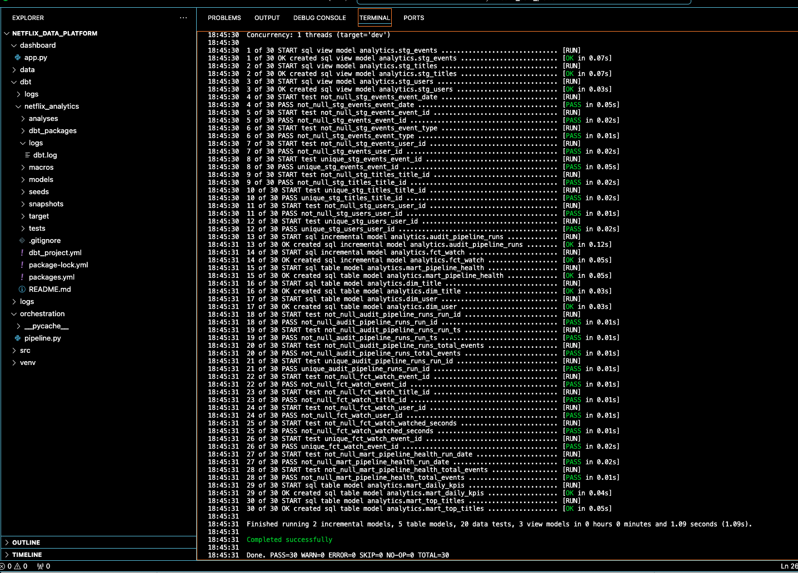
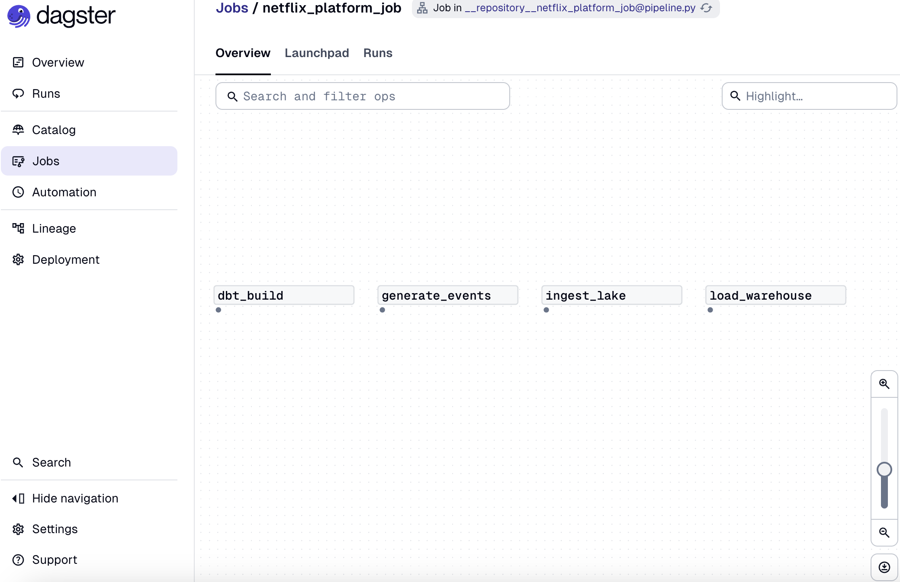
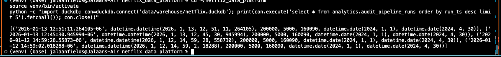

# End-to-End “Netflix-style” Data Platform

This project simulates a **production-grade analytics data platform** inspired by Netflix-scale architectures. It demonstrates how raw behavioral events are ingested, transformed, tested, orchestrated, and surfaced through analytics-ready datasets and dashboards.

The project is designed to reflect **real-world data engineering and analytics engineering workflows** used at companies like Netflix, Meta, Stripe, and other data-driven organizations.

---

## What This Project Demonstrates

- End-to-end data platform design (ingestion → lake → warehouse → marts → dashboard)
- Analytics engineering using **dbt** (staging, marts, tests, documentation)
- Pipeline orchestration and observability using **Dagster**
- SQL-first analytics modeling with **DuckDB**
- Python-based ETL and synthetic event generation
- Data quality validation and pipeline health auditing
- Clear separation of raw, transformed, and business-facing data layers

---

## Tech Stack

- **Python** — event generation, ingestion, orchestration logic  
- **DuckDB** — analytical warehouse  
- **dbt** — transformations, tests, analytics models  
- **Dagster** — pipeline orchestration and monitoring  
- **Streamlit** — analytics dashboard  
- **Parquet** — data lake storage format  

---

## Architecture Overview

### 1. Event Generation
Synthetic Netflix-style watch events are generated using Python, simulating user engagement with streaming content.

### 2. Data Lake
Raw events are written to a partitioned Parquet-based data lake, organized by `event_date` for scalable querying.

### 3. Warehouse
Data is loaded into DuckDB, serving as a lightweight analytical warehouse with raw tables for users, titles, and events.

### 4. Analytics Engineering (dbt)
Transformations follow a layered dbt architecture:
- **Staging models** clean and standardize raw data  
- **Fact and dimension tables** model user behavior and content consumption  
- **Marts** expose business-ready KPIs  
- **Tests** enforce data quality and pipeline reliability  

### 5. Orchestration & Monitoring
Dagster orchestrates the full pipeline, coordinating ingestion, loading, and transformations. Pipeline runs are tracked via audit tables to support observability and debugging.

### 6. Analytics Dashboard
A Streamlit dashboard visualizes KPIs, engagement trends, and top-performing titles.

---

## Screenshots

### Streamlit Dashboard

### dbt Build (Models + Tests)

### Dagster Orchestration Graph

### Project Structure

### Pipeline Health & Audit History

---

## Key Data Models

- **stg_events / stg_users / stg_titles** — cleaned staging models  
- **fct_watch** — fact table capturing user watch behavior  
- **dim_user / dim_title** — dimension tables  
- **mart_daily_kpis** — daily engagement metrics  
- **mart_top_titles** — top-performing content  
- **audit_pipeline_runs** — pipeline execution history  

---

## Why This Project Matters

This project reflects how modern analytics teams operate at scale:

- SQL-first analytics engineering  
- Production-style data modeling and testing  
- End-to-end pipeline orchestration with observability  
- Clear ownership of data from ingestion through analytics delivery  

It demonstrates the ability to **design, build, and reason about analytics platforms**, not just write isolated scripts or dashboards.

---

## Author

Built by **Jalaan Fields**  
Focused on data engineering, analytics engineering, and production-grade data platforms.
